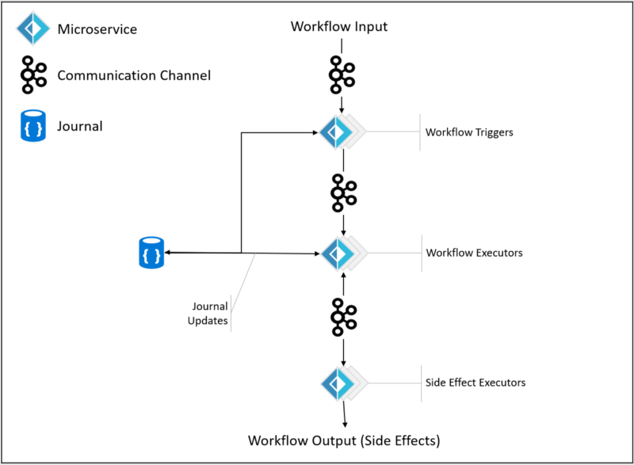
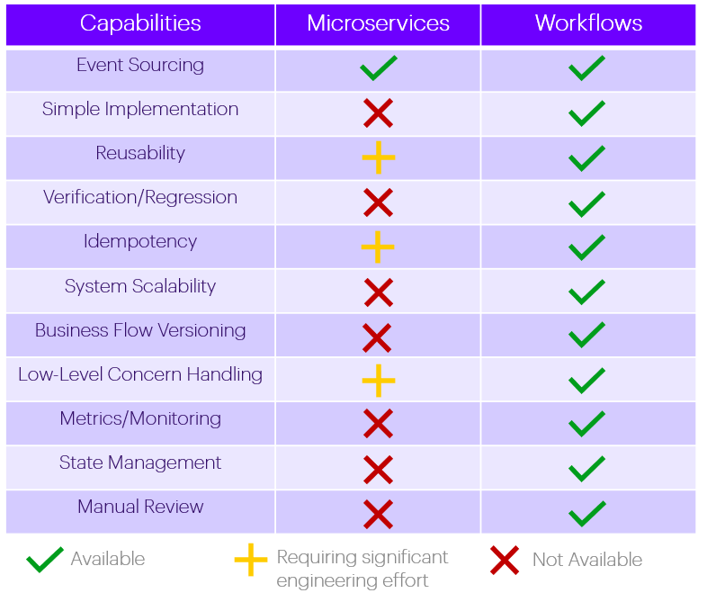
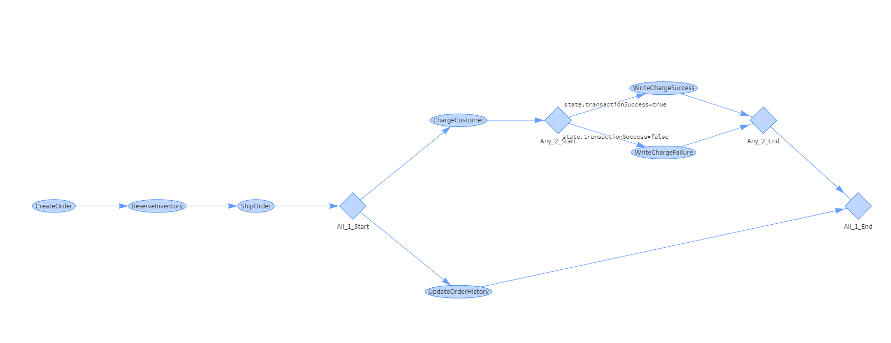

# 后端技术架构

任何技术系统都是为其业务服务。技术是达成业务目标的手段。虽然每个业务系统都强调正确性、可靠性、可维护性、开发效率和灵活性，但是真正明白自己业务系统特点并能做出合适的选择还需要对业务系统和相关技术的有深刻、本质性的理解。

## 业务系统特点

我们的差旅管理业务有不同形态的客户群体，不同形态的产品，复杂多变的业务流程。产品、客户、业务功能需要灵活的组合并且经常变。即使同一个处理流程，不同的客户也需要各种定制功能。

传统的做法是编写一套处理流程，包含所有业务处理任务，每个客户群体，甚至每个客户通过参数定制。再加上产品维度，这种做法会让主流程非常复杂，参数配置会非常多。结果就是不堪重负，难以维护，运行缓慢。

## 技术系统需求

一个理想的系统的架构就是以尽可能靠近物理世界的方式运作。这样一个系统比较高效而且（表面上）容易理解。现实生活中业务系统在时空上都是以一种总体异步，局部同步的多个体并行方式在工作。特定时空的业务内容包含业务处理和数据两个维度。

不同于传统做法，采用类似于数学的分形（fractal）思想，把系统功能分成可以组合的细颗粒任务，然后以一种一致的方式对不同客户/产品进行任意组合。结果就是一种基于工作流（workflow）的工作方式。

从数据的角度，这篇 2004 年[星巴克不用二阶段提交](https://www.enterpriseintegrationpatterns.com/ramblings/18_starbucks.html)的博客揭示了业务数据的本质：异步、弱序列、灵活错误处理（放弃/重试/补偿）、最终一致性。

近些年分布式系统的趋势回应了类似我们业务系统需求的特点。大趋势是采用异步、分布式并发的工作方式。事物处理也大都是采用最终一致性的工作方式，放弃强一致性换来高并发和高可靠。

## 技术选型

因为对技术要求比较高，灵活的 Workflow 的工作方式并不多见。[Jet Tech 的 Workflow 博客](https://medium.com/jettech/microservices-to-workflows-expressing-business-flows-using-an-f-dsl-d2e74e6d6d5e) 是一个比较出名的例子。

Workflow 的一个基本要求就是把数据和处理数据的函数分开。传统的面向对象编程（封装和继承）在这种场合是一种反模式的模型。函数式编程模型，尤其是响应式流处理（reactive streams）和 workflow 有着天然的契合。流行的基于 JVM 的异步流处理框架有 RxJava, Spring Reactor, Vert.x, Ratpack 和 Akka。

除 Akka， 其他框架/类库都比较新而且工作在较低的 Reactive Streams 模型上。使用者需要在 `Flux`, `Mono`, `Subscription` 这种原始概念上逐层建立自己的高层次业务抽象模型。RxJava 有比较完善的开源生态系统。可是采用 Java 语言，在错误处理和运行监控方面的处理都比较复杂。一种流行的说法是使用 RxJava 的工程师需要有六年以上 Java 工作经验。

Akka 就是为了异步分布式处理量身定做的一个工具库（toolkit）。借鉴了 Erlang OTS 的 Actor model, Akka Actor 发布于 2009 年 7 月, Akka Streams 2015 年 4 月发布。做为 Rective Streams 的标准制定参与者和异步分布式处理的长期实践者，Akka Streams 的开发者明白应用开发需要高层次的抽象工具。2014 年 9 月发布的[Akk Stream 预览版](https://akka.io/blog/news/2014/09/12/akka-streams-0.7-released) 就封装了底层接口并支持流程领域特定语言（Flow DSL）来定义灵活组合流程（flow）的 流程图（flow graph）。

借鉴 [Jet Workflow](https://medium.com/jettech/microservices-to-workflows-expressing-business-flows-using-an-f-dsl-d2e74e6d6d5e), 一个好的工作流工具库需要满足下面几个条件：

- 强类型：太多的复杂数据类型，需要编译时验证和编程时即时帮助。
- 可读性：清楚定义流程步骤和分支，容易理解和维护。
- 显式错误处理：支持基本的丢弃、重试和补偿错误处理方式。
- 可扩展：以一种标准方式支持灵活的业务处理组合与扩展。

相比微服务，workflow 是更高层次的抽象。如下图：

下面是一个 Jet Tech 的流程处理例子。

Jet Tech 在 2018 年用 FSharp 开发了一套自己的内部工作流工具库。而 Akka Streams 是一个成熟的开源软件，如果不想从头开发，基本上是目前的唯一选择。

## 数据库访问

目前流行的数据库访问模式有三种：ORM、SQL 和 Type-safe SQL。对应的实现有 Hibernate, JdbcTempalte/MyBatis, 和 jOOQ/QueryDSL。数据库访问应该满足下面条件：

- 显式的数据库访问：清清楚楚知道连接的范围，事务处理的范围，数据是否缓存等。
- 静态类型&类型安全：可以编译检查数据类型，也方便重构。
- 高效&精准控制：只查询所要的数据和修改要修改的数据，一次数据库访问完成。
- 简单的关联数据查询：方便的访问有关系的表。
- 方便的数据映射：程序数据结构和数据库表数据的方便转换。这个函数式语言有先天优势。
- 支持原始 SQL： 总有场合需要这个功能。
- 手工或自动元数据生成。

在 Java 语言里面，只有 jOOQ/QueryDSL 满足上面多数条件。如果采用函数式语言如 Scala，则打开了另一扇门 Functioinal Relational Mapping (FRM)。由于关系型数据库的基本操作（关系运算和关系演算）是函数演算的一个子集，FRM 有着天然的契合度。Scala 的 [Slick FRM 库](https://slick.lightbend.com/) 也满足上面的要求。

## 可选技术栈

Akka 同时支持 Java 和 Scala。考虑到从 Web API 服务到数据库访问的整个流程处理，我们有四种选择。

- Java: Spring WebFlux + Akka Streams/Actor + jOOQ (方案一)
- Java: Spring DI + Akka HTTP + Akka Streams/Actor + jOOQ (方案二)
- Java: Spring DI + Play framework + Akka Streams/Actor + jOOQ (方案三)
- Scala: Play framework + Akka Stream/Actor + Slick (方案四)
- Scala: Akka HTTP + Akka Stream/Actor + Slick (方案五)

前三个方案都是基于 Java 和 Spring DI，主要是为了方便现有团队的技术升级。方案一和方案二都已经开发出了概念原型，包括 jOOQ 的异步访问库。方案三花了一天时间还没有调通。方案四和五是 Scala 的标准配置，没有什么悬念。

方案一有二个变种，在 Controller 层返回 Akka Steam 的 `Source` 或 Spring actor 的 `Flux/Mono`。前者按官方文档是支持的，可是一直没有调通，虽然都是同一个标准，有双方接口支持，可是其实并不匹配。后一个变种调通了，可是代码非常难看。

方案二比较可行灵活。不过需要自己实现 Web Api 层的路由，参数转换/验证，错误处理框架和 pluting 框架，有一些工作量。在整个链条处理上，处处感觉到 Java 的坑，既有 Java 非函数语言本身的特点，也有 Akka 把 Java 做为二等公民的不给力支持。学习资料比较少。

方案三官方的库很久没有更新，做起来需要对二个框架都需要比较深的了解，每次版本升级都有坑要填，常见还是会弃用 Spring 框架。

方案四是个标配方案，优点非常明显：

- 成熟： 各个技术板块都有 10 年左右的实践经验，是所有方案里面最可靠的。
- 原生支持：Scala 是 Akka 的原生开发语言，文档也很丰富。
- 技术优势明显：相比其其它混合框架和非原生编程语言模式，方案四是自包含生态，没有集成问题。
- Slick 的 FRM 数据库访问是目前最好的模式。技术层面远超其它 ORM 或 typesafe SQL。比起 基于 Scala 的新数据库框架 [quill](https://getquill.io/)， Slick 的优点是 Stream API，能够和 Akka Streams 无缝集成。

Slick FRM 数据库访问的优点：

- 基于集合的概念，和 SQL 概念吻合
- 强类型
- 手工或自动的模式生成
- 支持复杂的关系查询
- 方便的多语句查询和事物处理
- 支持原生 SQL 和数据转换
- 不用缓存

但是方案四的缺点是 Play 过于复杂，很多功能是为了渲染 Web 页面而做，对于我们的 REST API 没有太大用处。方案五和方案四的唯一差别是我们用 Akka HTTP 而不是 Play 做 REST API 的请求处理。Akka HTTP 有我们需要的如下 REST API 服务功能

- 基于 DSL 的路由配置
- 高层和底层的 HTTP 请求处理
- 方便的 Marshalling and unmarshalling 功能
- 方便的认证和授权的集成
- 较好的错误处理机制
- Stream-based 的接口
- 简单的数据转换处理
- 类型安全

方案四和五的最大问题是 Scala 语言。Scala 是一个多范式语言，同时支持面向对象和函数式编程。这成为其最大卖点和最大缺点。短期来看，多范式是一个负资产。具体体现如下：

- 学习曲线比较陡：二个范式的学习和贯通通常需要三到六个月成为熟手，精通则需要一年以上。
- 有面向对象的经验是学习障碍：函数式的思维很多地方和面向对象是相反的，改掉旧习惯来学习相反的新习惯比没有旧习惯来学习更难。
- 多范式容易让让人走偏：本来函数式是很适合要解决的问题，可是随手可用的面向对象功能随时让人走偏。

## 技术栈选择

所有的业务运行问题都是人的问题。我们百里挑一组建的团队学习和研发能力是方案选择的最关键考量。

- 我们团队学习能力强。
- 并行转型方案
  - 少数人原型尝试，总结。
  - 多数人仍用现有模式开发，六个月到一年完成转型。
- 保底方案：现有 Spring 架构加 jOOQ 替换 Jpa/Hibernatge。

结论： 对于 REST API 服务我们采用方案五。如果有网页生成需求，则方案四为最佳选择。
