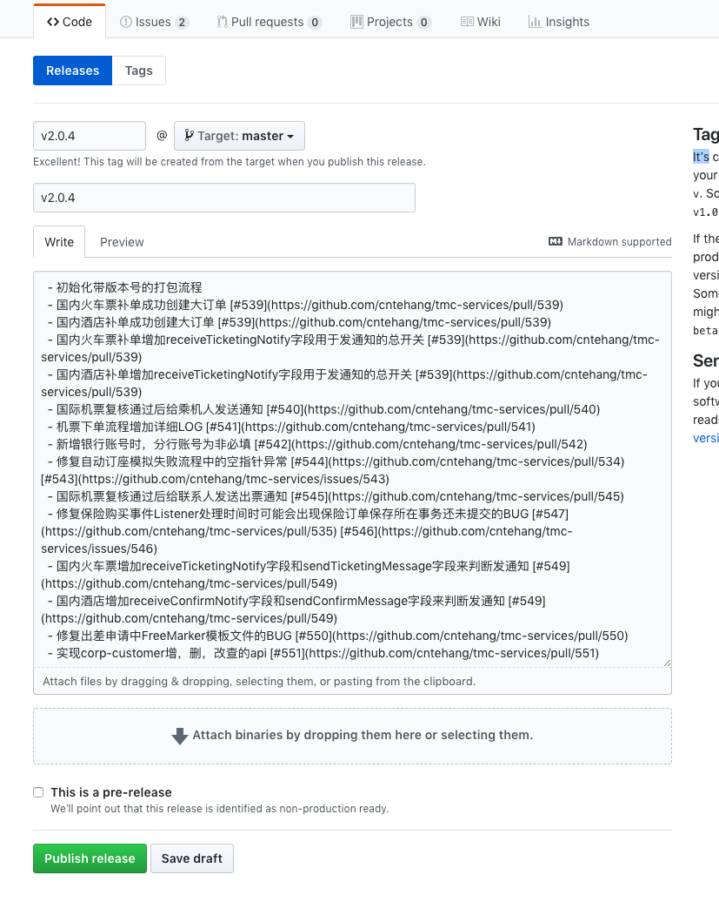

# 发布流程


在test/prod环境，需要进行代码与运行程序的版本化控制，目前项目使用github的release功能来做版本发布与管理，结合项目工程，制定该流程。

## 1. 发版流程

发布新版本的流程如下：

1. 发版

登录github，在工程页面，点击release -> Draft a new release -> 填写对应的version tag(来自于build_scripts/application_version.gradle中的版本号)与release title(与version一致)，从updlate文档把修改历史拷贝到describe中 -> Publish release，如下：



2. 通知运维发布新版，并确定发版成功

3. 版本迭代

发布之后，发布人需要把当前版本号更新迭代，如v2.0.1 -> v2.0.2，迭代涉及以下工作：

- 修改build_scripts/application_version.gradle中的版本号
- 新建该版本对应的sql目录
- 修改update文件，把版本号改为最新的，并且删除所有的修改历史
- 把上述修改push并merge到master中

*特别注意：*
- release Tag version 是打包时实际上采用的版本号，应与 application_version.gradle 中的版本号一致，且与 update.md 中的当前版本字段一致
- release Title 与 release Tag version 保持一致
- release 描述文字，复制 update.md 中的**更新内容**和**回滚操作**中的条目对齐即可

## 2. 版本相关文件

在工程中，与版本相关的几个文件，特此说明：

### 2.1 build_scripts/application_version.gradle

打包相关的版本信息，内部记录了对应的版本号，发版之后需要按照流程迭代版本号

```text
version = 'v2.0.1'
jar {
  archivesBaseName = 'tmc-services'
}
```

### 2.2 sql/vX_X_X

    对应版本需要执行的sql语句存放的目录，vX_X_X与版本号对应，由发版人员新建，开发人员在该版本使用的sql都存放在对应的目录下

### 2.3 update.md

对应版本的修改历史，具体内容如下：

```text
# 版本升级基本内容
- 当前版本 v2.0.2
- 上一版本 v2.0.1
- 更新内容:
    - 登录流程中加入了验证码元素，当登录失败超过三次需要输入验证码，最后一次输入错误15分钟后可不用输入验证码
- 回滚操作
```

以上所写内容应概括本次提交中的要点，需注意以下几点

- 版本号由发版人在发布新版后迭代更新，与application_version中的版本号一致，在发布该版本之前不允许修改
- 开发过程中，每个pr都需要如实记录提交的内容，并且带上pr链接与issue链接
- 发布成功后，由发布人更新update文档