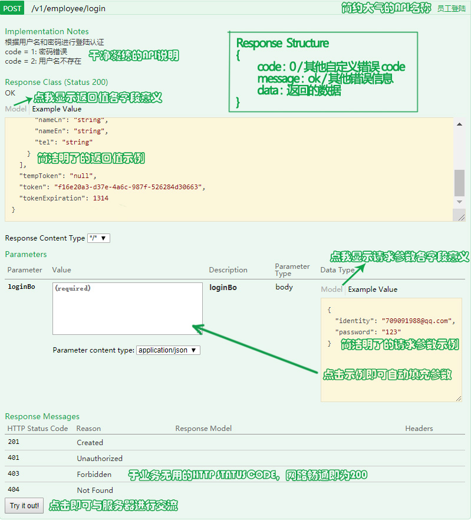

# Swagger-usage-guideline

- swagger 文档应成为前端调用后端接口的手册，在此对 swagger 使用进行规范，方便前后端交互。

## API 名称和说明

- 在 Controller 中对外暴露的方法上加上如下注解

```java
@ApiOperation(value = "API名称", notes = "API说明")
```

- 若该 API 有需要指出的异常情况，则在 notes 中加以说明，如下：

```java
@ApiOperation(
    value = "员工登录",
    notes = "根据用户名和密码进行登录认证</br>"
        + "code = 1: 密码错误</br>"
        + "code = 2: 用户名不存在"
    )
```

- 有一种对返回值的写法如下，其会将 code 视为 Http Status Code，并不适合我们的情况，故不采用

```java
  @ApiResponses(value = {
      @ApiResponse(code = 1, message = "密码错误"),
      @ApiResponse(code = 2, message = "用户名不存在")
  })
```


## 请求参数说明

- 参数若为类对象：

  - 类名上需加如下注释，用于说明此对象参数的名称：（这个注解完全没必要用）
    - value：对象参数名。特别注意：**value不要用中文**，会导致swagger导出json失败

    ```java
    @ApiModel(value = "xxx")
    ```

  - 类中字段需在 @ApiModelProperty 注解中加如下说明：
    - value：表示字段名
    - example：表示该字段的示例值，在测试时很有帮助，但是，千万不要有单引号，遇到复杂类型，宁可不写example
    - required: 若为必携带的参数，则为true
  
    ```java
      @ApiModelProperty(value = "用户名，可以为手机/邮箱", example = "709091988@qq.com", required = true)
    ```

- 若为普通参数：
  - 在方法的请求参数前，与 @RequestParam并列

  ```java
  @ApiParam(value = “用户ID”, example = "1100020")
  ```

## 返回值说明

- 与请求参数如出一辙
- 暂未看到返回非对象的注解方法，不过返回非对象的情况很少，基本可以忽略

## Sagger 配置类示例

```java
@Configuration
@EnableSwagger2
public class SwaggerConfig {

  /**
   * swagger配置
   * @return swagger相关配置
   */
  @Bean
  public Docket createRestApi() {
    return new Docket(DocumentationType.SWAGGER_2)
            .apiInfo(apiInfo())
            .select()
            .apis(RequestHandlerSelectors.basePackage("com.tehang.tmc.services.application.rest.front.corp"))
            .paths(PathSelectors.any())
            .build();
  }

  private ApiInfo apiInfo() {
    return new ApiInfoBuilder()
            .title("TMC Services")
            .description("出行从未如此简单")
            .contact(new Contact("TMC group", "https://www.teyixing.com", "admin@teyixing.com"))
            .version("1.0")
            .build();
  }

}
```

## Swagger 文档界面说明

