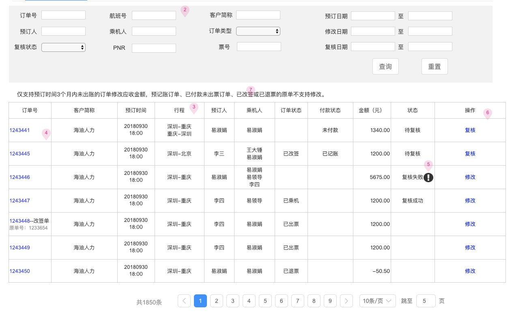

# 一个简单查询展示页面

示例图：

后台大部分页面都是简单查询展示页面，样式风格也是统一的，为了简化后台的开发，故做此简单的约定

## 页面布局

页面分 2 个部分：顶部是搜索条件表单，底部是数据展示表格，完整示例代码如下：

```html
<form nz-form [formGroup]="form" class="form-small">
  <se-container [col]="4" [labelWidth]="80">
    <se label="订单号">
      <input nz-input formControlName="bigOrderNoLike" />
    </se>
    <se label="航班号">
      <input nz-input formControlName="flightNoLike" />
    </se>
    <se label="客户简称">
      <input nz-input formControlName="corpShortNameLike" />
    </se>
    <se label="预订日期">
      <nz-date-picker
        formControlName="bookingTimeStart"
        class="width-45"
      ></nz-date-picker>
      ~
      <nz-date-picker
        formControlName="bookingTimeEnd"
        class="width-45"
      ></nz-date-picker>
    </se>
    <se label="预订人">
      <input nz-input formControlName="bookingEmployeeNameLike" />
    </se>
    <se label="乘机人">
      <input nz-input formControlName="passengerNameLike" />
    </se>
    <se label="订单类型">
      <shared-dict-select
        formControlName="orderFlag"
        dictType="OrderFlag"
      ></shared-dict-select>
    </se>
    <se label="修改日期">
      <nz-date-picker
        formControlName="modifyTimeStart"
        class="width-45"
      ></nz-date-picker>
      ~
      <nz-date-picker
        formControlName="modifyTimeEnd"
        class="width-45"
      ></nz-date-picker>
    </se>
    <se label="复核状态">
      <shared-dict-select
        formControlName="modifyStatus"
        dictType="FlightOrderModifyStatus"
      ></shared-dict-select>
    </se>
    <se label="PNR">
      <input nz-input formControlName="pnrLike" />
    </se>
    <se label="票号">
      <input nz-input formControlName="ticketNoLike" />
    </se>
    <se label="复核日期">
      <nz-date-picker
        formControlName="reviewTimeStart"
        class="width-45"
      ></nz-date-picker>
      ~
      <nz-date-picker
        formControlName="reviewTimeEnd"
        class="width-45"
      ></nz-date-picker>
    </se>
    <se labelWidth="0">
      <button
        nz-button
        type="submit"
        nzType="primary"
        [disabled]="isSpinning$ | async"
        (click)="st.reset()"
      >
        查询
      </button>
      <button nz-button type="reset">清空</button>
    </se>
  </se-container>
</form>
<nz-spin nzTip="正在查询中,请稍候..." [nzSpinning]="isSpinning$ | async">
  <st
    #st
    class="table-text-center table-small"
    [bordered]="true"
    [columns]="columns"
    [data]="data$ | async"
    (change)="onSTChange($event)"
    [page]="stPageConfig"
  >
    <ng-template st-row="bigOrderNo" let-i>
      <a routerLink="../order-detail/{{ i.id }}">{{ i.bigOrderNo }}</a>
    </ng-template>
    <ng-template st-row="bookingTime" let-i>
      <span>{{ i.bookingTime | _date: 'yyyy-MM-dd HH:mm' }}</span>
    </ng-template>
    <ng-template st-row="status" let-i>
      <span>{{ i.status | dictValue: 'FlightOrderStatus' }}</span>
    </ng-template>
    <ng-template st-row="paymentStatus" let-i>
      <span>{{ i.paymentStatus | dictValue: 'FlightOrderPaymentStatus' }}</span>
    </ng-template>
    <ng-template st-row="ticketingTime" let-i>
      <span>{{ i.ticketingTime | date: 'yyyy-MM-dd HH:mm' }}</span>
    </ng-template>
    <ng-template st-row="modifyStatus" let-i>
      <span>{{ i.status | dictValue: 'FlightOrderModifyStatus' }}</span>
    </ng-template>
  </st>
</nz-spin>
```

**_注意：_**

- `[col]="4" [labelWidth]="80"` 根据实际原型调整
- 统一使用 ReactiveForms 禁止使用 Template-driven forms

## 基本逻辑代码

```ts
import {
  Component,
  OnInit,
  ChangeDetectionStrategy,
  ViewChild,
} from '@angular/core'
import { FormBuilder, FormGroup } from '@angular/forms'
import { Observable } from 'rxjs'
import { map, catchError } from 'rxjs/operators'
import { STColumn, STComponent, STChange } from '@delon/abc'
import { Logger, LoggerService, LoadingService } from '@submodule/web/services'
import { DateUtils } from '@submodule/web/utils'
import { AdminFlightModifyHttpService } from '@submodule/common/services/http'
import {
  FlightOrderModifyAmountQueryBo,
  FlightOrderModifyAmountBo,
  AppError,
} from '@submodule/common/models'

@Component({
  selector: 'modify-list',
  templateUrl: './modify-list.component.html',
  styles: [],
  changeDetection: ChangeDetectionStrategy.OnPush,
})
export class ModifyListComponent implements OnInit {
  columns: STColumn[] = [
    { title: '订单号', render: 'bigOrderNo' },
    { title: '客户简称', index: 'corpShortName' },
    { title: '预订时间', render: 'bookingTime' },
    { title: '行程', index: 'cityNames' },
    { title: '预订人', index: 'bookingEmployeeName' },
    { title: '乘机人', index: 'passengerNames' },
    { title: '订单状态', render: 'status' },
    { title: '付款状态', render: 'paymentStatus' },
    { title: '金额(元)', index: 'paymentAmount' },
    { title: '复核状态', render: 'modifyStatus' },
    {
      title: '操作',
      buttons: [
        {
          text: '复核',
          click: record => {
            console.log(record)
          },
        },
        {
          text: '修改',
          click: record => {
            console.log(record)
          },
        },
      ],
    },
  ]
  stPageConfig = {
    front: false,
    show: true,
    showSize: true,
    showTotal: true,
    showQuickJumper: true,
  }
  data$: Observable<FlightOrderModifyAmountBo[]>
  @ViewChild('st') st: STComponent
  isSpinning$ = this.loadingService.isLoading
  form: FormGroup
  private log: Logger

  constructor(
    loggerService: LoggerService,
    private formBuilder: FormBuilder,
    private httpService: AdminFlightModifyHttpService,
    private loadingService: LoadingService,
  ) {
    this.log = loggerService.getLogger(ModifyListComponent.name)
  }

  ngOnInit() {
    this.createForm()
    this.query()
  }

  onSTChange(event: STChange) {
    const eventType = event.type
    if (eventType === 'pi' || eventType === 'ps') {
      this.query()
    }
  }

  private query() {
    const methodName = 'query'
    const params = this.getQueryParams()
    this.log.debug(methodName, params)
    this.data$ = this.httpService.getOrdersForAmountModify(params).pipe(
      map(res => {
        this.st.total = res.totalElements
        return res.content
      }),
      catchError((err: AppError) => {
        err.setCallStack(ModifyListComponent.name, methodName, params)
        throw err
      }),
    )
  }

  private getQueryParams(): FlightOrderModifyAmountQueryBo {
    const formValue = this.form.value

    return {
      ...formValue,
      bookingTimeStart: DateUtils.startOfDay(formValue.bookingTimeStart),
      bookingTimeEnd: DateUtils.startOfDay(
        DateUtils.addDays(formValue.bookingTimeEnd, 1),
      ),
      modifyTimeStart: DateUtils.startOfDay(formValue.modifyTimeStart),
      modifyTimeEnd: DateUtils.startOfDay(
        DateUtils.addDays(formValue.modifyTimeEnd, 1),
      ),
      reviewTimeStart: DateUtils.startOfDay(formValue.reviewTimeStart),
      reviewTimeEnd: DateUtils.startOfDay(
        DateUtils.addDays(formValue.reviewTimeEnd, 1),
      ),
      pageNumber: this.st.pi,
      pageSize: this.st.ps,
    }
  }

  private createForm(): void {
    this.form = this.formBuilder.group({
      bigOrderNoLike: [''],
      flightNoLike: [''],
      corpShortNameLike: [''],
      bookingTimeStart: [''], // UTC
      bookingTimeEnd: [''], // UTC
      bookingEmployeeNameLike: [''],
      passengerNameLike: [''],
      orderFlag: [''], // OrderFlag
      modifyTimeStart: [''],
      modifyTimeEnd: [''],
      modifyStatus: [''], // FlightOrderModifyStatus
      pnrLike: [''],
      ticketNoLike: [''],
      reviewTimeStart: [''], // UTC
      reviewTimeEnd: [''], // UTC
    })
  }
}
```

## 页面样式

为了保持系统的整体性和统一行，非特殊的查询展示页统一使用: `class="form-small"` `class="table-text-center table-small"`  
以上样式定义在 `index.less` 中 便于统一修改
