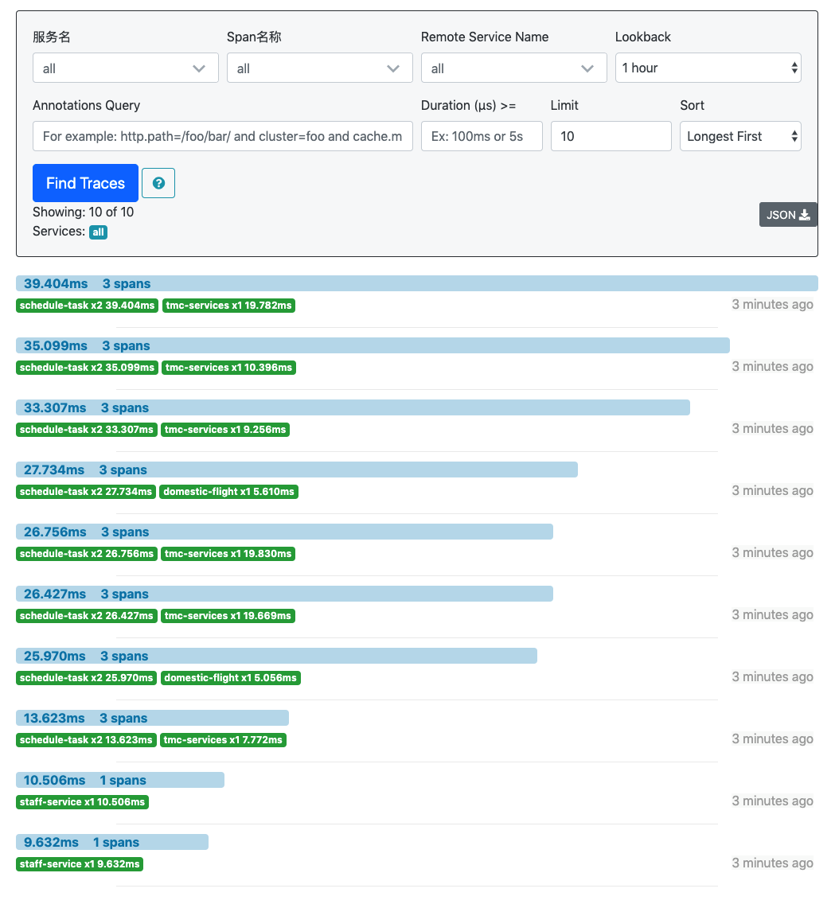
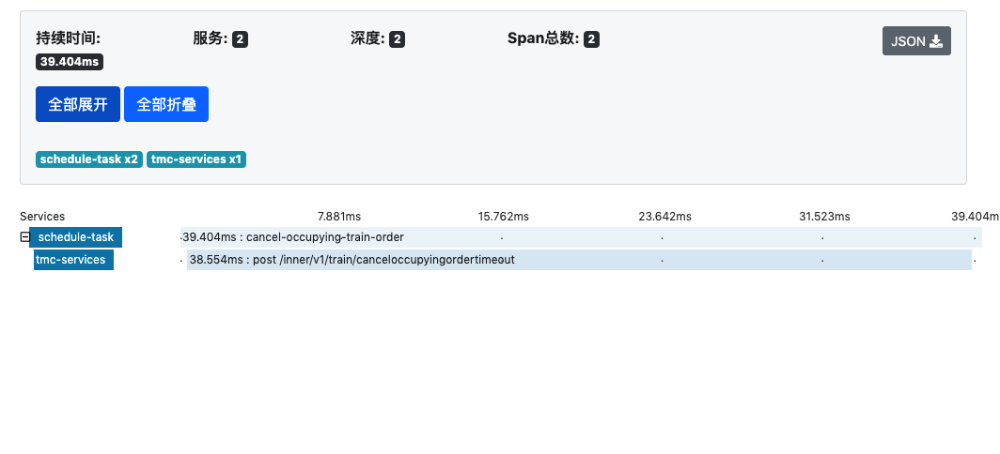

# 使用Spring Cloud Sleuth和Zipkin进行分布式链路跟踪

## 前言

我们目前采用的是微服务结构，随着业务发展，服务拆分导致系统调用链路愈发复杂，以TMC服务的机票预订流程为例，创建一个订单需要调用tmc-services、basic-resource、domestic-flight-service、flight-dynamic、insurance-service、mail-service、sms-service等多个服务才能完成，当整个请求变慢或不可用时，我们是无法得知该请求是由某个或某些服务引起的，这时就需要解决如何快速定位服务故障点，以对症下药。于是就有了分布式系统调用跟踪的诞生。

## 技术选型

**Spring Cloud Sleuth** + **Zipkin** + **Elasticsearch**

Spring Cloud Sleuth主要功能就是在分布式系统中提供追踪解决方案，并且兼容支持了 Zipkin，我们只需通过添加项目依赖即可实现追踪功能。

- Spring Cloud Sleuth 数据收集
- Elasticsearch 数据存储
- Zipkin 数据展示

## Spring Cloud Sleuth

[Spring Cloud Sleuth](https://cloud.spring.io/spring-cloud-static/spring-cloud-sleuth/2.1.0.RELEASE/single/spring-cloud-sleuth.html)为服务之间调用提供链路追踪。通过Sleuth可以很清楚的了解到一个服务请求经过了哪些服务，每个服务处理花费了多长。从而让我们可以很方便的理清各服务间的调用关系。

### 术语

- **Trace**：一系列Span组成的一个树状结构。请求一个服务的API接口，这个API接口，需要调用多个微服务，调用每个微服务都会产生一个新的Span，所有由这个请求产生的Span组成了这个Trace。

- **Span**: 最基本的工作单元。例如: 发送一个RPC就是一个新的span，同样一次RPC的应答也是。Span通过一个唯一的ID来作为标识，另外，再使用一个ID用于服务调用跟踪。Span也可以带有其他数据，例如：描述，时间戳，键值对标签，起始Span的ID，以及处理ID等等。 Span有起始和结束，它们用于跟踪时间信息。Span应该都是成对出现的，有始必有终，所以一旦创建了一个span，那就必须在未来某个时间点结束它。

- **Annotation**: 用于记录一个事件的时间信息。一些基础核心的Annotation用于记录请求的起始和结束时间，例如：
  - **cs**: 客户端发送(Client Sent的缩写)。这个annotation表示一个span的起始;
  - **sr**: 服务端接收(Server Received的缩写)。表示服务端接收到请求，并开始处理。如果减去`cs`的时间戳，则可以计算出网络传输耗时。
  - **ss**: 服务端完成请求处理，应答信息被发回客户端(Server Sent的缩写)。如果减去`sr`的时间戳，则可以计算出服务端处理请求的耗时。
  - **cr**: 客户端接收(Client Received的缩写)。标志着Span的结束。客户端成功的接收到服务端的应答信息。如果减去`cs`的时间戳，则可以计算出请求的响应耗时。

  下图，通过可视化的方式描述了Span和Trace的概念：

  

### 支持的组件

Spring Cloud Sleuth可以追踪以下10种类型的组件

- Async
- Scheduled
- Messaging
- Hystrix
- Feign
- RestTempate
- Zuul
- RXJava
- WebSocket

`以上组件若想实现追踪功能，必须通过注入的方式交由Spring进行管理，否则无法生效。`

## Zipkin

Zipkin是一个开放源代码分布式的跟踪系统，由Twitter公司开源，提供的功能包括：数据的收集、存储、查找和展现。

每个服务向zipkin报告计时数据，zipkin会根据调用关系通过Zipkin UI生成依赖关系图，显示了每个跟踪请求通过了多少个服务，让开发者可通过一个Web前端轻松的分析数据。

## 案例实战

### 构建Zipkin-Server工程

在程序的启动类Application加上@EnableZipkinServer开启ZipkinServer的功能

```java
@SpringBootApplication
@EnableZipkinServer
public class Application {

    public static void main(String[] args) {
        SpringApplication.run(Application.class, args);
    }
}
```

在配置文件application.yml文件，指定服务名为zipkin-server，端口为xxxx

```java
server:
  port: xxxx
spring:
  application:
    name: zipkin-server
```

### 需要加入追踪功能的服务(这里以tmc-services为例)

在application_dependencies.gradle中加入sleuth、zipkin的依赖

```java
dependencies {
  // for service trace
  compile('org.springframework.cloud:spring-cloud-starter-sleuth:2.1.0.RELEASE')
  // zipkin
  compile('org.springframework.cloud:spring-cloud-starter-zipkin')
}
```

修改application.xml,添加使用sleuth、zipkin的相关配置

```java
spring:
  application:
    name: tmc-services
  profiles:
    active: dev
  zipkin:
    base-url: https://dev-zipkin.teyixing.com #设置zipkin-server服务地址
  sleuth:
    web:
      client:
        enabled: true
    sampler:
      probability: 1.0 # 将采样比例设置为 1.0，也就是全部都需要。默认是 0.1
```

`这里需要注意的是：采样比例设置越高，对系统消耗越大，现在上线初期请求不多，这样设置没有问题，后期应根据实际情况进行适当调整`

修改logback.xml,更改日志记录格式，加入服务名称、traceID、spanID、parentID等信息

```xml
<?xml version="1.0" encoding="UTF-8"?>
<configuration>
    <springProperty scope="context" name="springAppName" source="spring.application.name" />
    <appender name="STDOUT" class="ch.qos.logback.core.ConsoleAppender">
        <encoder class="ch.qos.logback.classic.encoder.PatternLayoutEncoder">
            <pattern>%date [%thread] [serviceId:${springAppName:-}/traceId:%X{traceId}/spanId:%X{spanId}/parentId:%X{parentId}] %-5level %logger{80}.%M - %msg%n</pattern>
        </encoder>
    </appender>
    <appender name="FILE"
              class="ch.qos.logback.core.rolling.RollingFileAppender">
        <rollingPolicy class="ch.qos.logback.core.rolling.TimeBasedRollingPolicy">
            <FileNamePattern>log/businessDebug.%d{yyyy-MM-dd}.log</FileNamePattern>
            <MaxHistory>30</MaxHistory>
        </rollingPolicy>
        <encoder>
            <pattern>%date [%thread] [serviceId:${springAppName:-}/traceId:%X{traceId}/spanId:%X{spanId}/parentId:%X{parentId}] %-5level %logger{80}.%M - %msg%n</pattern>
        </encoder>
    </appender>
    <root>
        <level value="DEBUG"/>
        <appender-ref ref="FILE"/>
        <appender-ref ref="STDOUT"/>
    </root>
</configuration>
```

项目启动后，调用一个api，可以在控制台看到

``` log
2019-05-12 05:19:14,220 [http-nio-60028-exec-9] [serviceId:tmc-services/traceId:8b74d4ed976edf83/spanId:8b74d4ed976edf83/parentId:] INFO c.t.tmc.services.application.service.admin.train.AdminTrainApplicationService.getTrainOrderDetail - Get train order: 96214299298631680 detail by staff: 10060

2019-05-12 05:19:14,278 [http-nio-60028-exec-9] [serviceId:tmc-services/traceId:8b74d4ed976edf83/spanId:8b74d4ed976edf83/parentId:] INFO c.t.tmc.services.application.service.admin.train.AdminTrainApplicationService.getTrainOrderDetail - Get train order: 96214299298631680 detail by staff: 10060 successfully
```

可以看到日志里已加入服务Id、traceId、spanId、parentId,每个工作单元发送一次请求就会产生一个spanId，每个请求会产生一个tranceId和多个spanId，根据tranceId和spanId就能分析出一个完整的请求都经历了哪些服务单元。

打开Zipkin查看UI页面



能看到请求都经历了哪些服务节点。再点相关连接，可以查看调用顺序，并且还能看到在各个服务节点的处理的时间长度。

