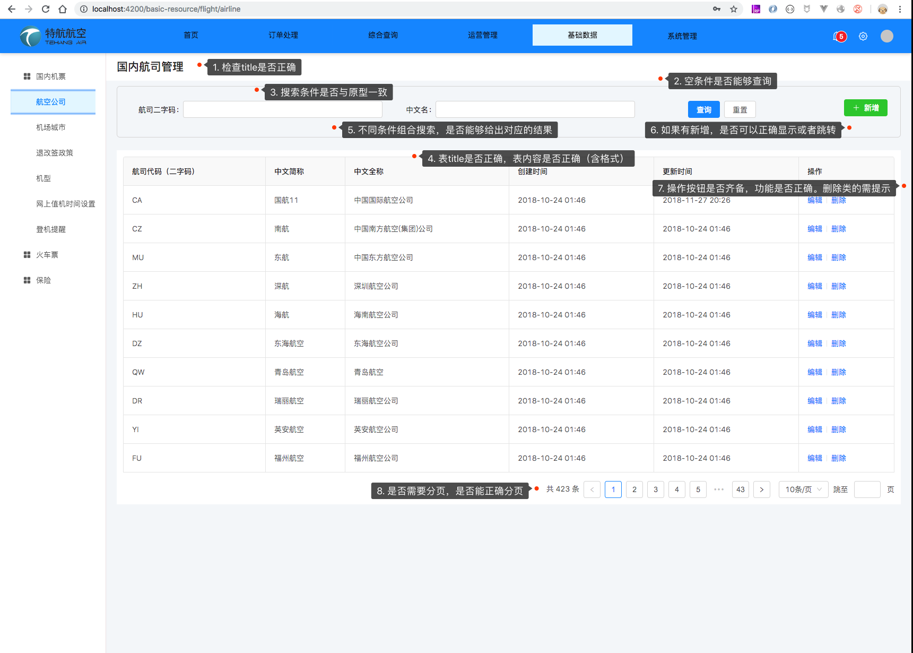

# 如何测试列表型页面
1. 检查title是否正确
2. 空条件是否能够查询，如果需要自动查询，是否在页面打开的时候自动查询
3. 搜索条件是否与原型一致：个数，名称，类型
4. 表title是否正确，表的内容是否显示正确：title数、顺序、名字；内容、格式、对齐方式
5. 不同条件的组合是否，是否能够给出对应的结果
6. 如果有新增之类功能，是否能够正确弹窗，或者跳转
7. 表中如果有操作，那么操作按钮是否齐备，如果按钮显示是有条件的（如根据不同的状态显示不同的操作），那么需要构造所有状态的数据。需保证每种按钮的功能都正常。所有删除类按钮，必须有确认步骤。
8. 是否需要分页，如果需要分页，那么分页、数据总数、跳转是否正确

